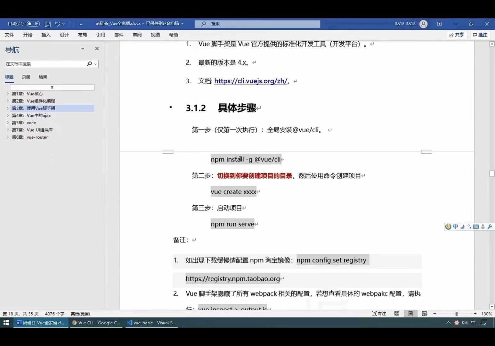

# 按Ctrl + Shift + V 访问
# 按照vue脚手架

# 数组过滤 filter 不改变原数组 
    1.返回符合条件的 不改变原数组  返回新数组
    const persons = [
        { id: '001', name: '马冬梅', age: 19, sex: '女' },
        { id: '002', name: '周冬雨', age: 20, sex: '女' },
        { id: '003', name: '周杰伦', age: 21, sex: '男' },
        { id: '004', name: '温兆伦', age: 22, sex: '男' }
    ]
    const arr = persons.filter((p) => {
        return p.name.indexOf('冬') !== -1
    })
    console.log(arr)
    console.log(persons)
# 数组 sort 排序
    收到？ 返回值？ 改变原数组？
    a,b             改变
   
    //sort 数组 收到？ 返回值？ 改变原数组？
    let arr = [1,3,2,6,4,5]
    arr.sort((a,b)=>{
        

    return a-b//升序
    return b-a//降序
    })
    console.log(arr)
   #  修改数组 7个
   #  数组最后一个位置 增加一个 push
   #  数组删除最后一个 pop
   #  数组删除第一个 shift
   #  数组一个位置 增加一个 unshift
   #  数组指定位置插入、删除、替换指定位置的某个元素 splice
   #  数组 排序 sort
   #  数组反转 reverse

    